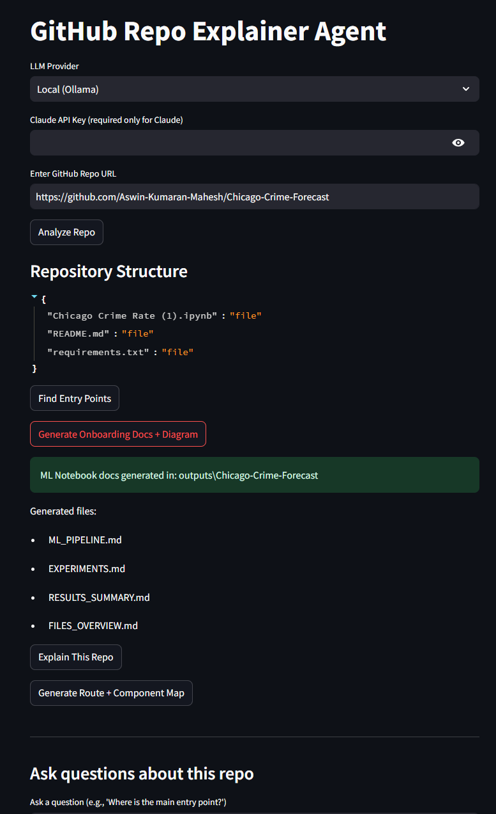

# GitHub Repo Explainer Agent

A Streamlit-powered tool that analyzes GitHub repositories and generates smart, context-aware documentation for onboarding developers.

## Features

- **Smart Repo Detection**: Automatically detects project type (Next.js, ML/Notebook, Python, Node.js)
- **Framework Detection**: Identifies FastAPI, Flask, Django, and Next.js with appropriate run commands
- **Next.js App Router Support**: Generates tailored onboarding docs with routing explanations, component structure, and dev commands
- **ML Notebook Mode**: For repos with `.ipynb` files, generates ML_PIPELINE.md, EXPERIMENTS.md, and RESULTS_SUMMARY.md
- **Dependency Diagrams**: Auto-generates Mermaid diagrams for Python and TypeScript/TSX imports
- **RAG-based Q&A**: Ask questions about the codebase using FAISS-indexed semantic search

## Screenshot



<!-- Screenshot should show the Streamlit app UI with repo analysis results -->

## Installation

```bash
# Clone the repo
git clone https://github.com/Aswin-Kumaran-Mahesh/repo-explainer-agent.git
cd repo-explainer-agent

# Create virtual environment
python -m venv venv
# Windows
venv\Scripts\activate
# macOS/Linux
source venv/bin/activate

# Install dependencies
pip install -r requirements.txt
```

### Dependencies

```
streamlit
anthropic
sentence-transformers
faiss-cpu
gitpython
```

## Usage

```bash
streamlit run app.py
```

Then open http://localhost:8501 in your browser.

### Workflow

1. **Enter a GitHub repo URL** and click "Analyze Repo"
2. **View the file tree** and explore the structure
3. **Generate docs** using one of the buttons:
   - "Generate Onboarding Docs + Diagram" - Creates context-aware documentation
   - "Explain This Repo" - LLM-generated comprehensive explainer
   - "Find Entry Points" - Detect frameworks and run commands
4. **Ask questions** about the codebase using the Q&A section

## Generated Documentation

### For Next.js App Router projects:
- `ONBOARDING.md` - Quick start, routing explanation, key files
- `ARCHITECTURE.md` - TypeScript import dependency diagram
- `FILES_OVERVIEW.md` - Repository structure

### For ML/Notebook projects:
- `ML_PIPELINE.md` - Environment setup, Jupyter instructions, pipeline stages
- `EXPERIMENTS.md` - Notebook tracking, experiment checklist
- `RESULTS_SUMMARY.md` - Performance tables, limitations, future work

### For other projects:
- `ONBOARDING.md` - Generic quick start guide
- `ARCHITECTURE.md` - Python dependency diagram
- `FILES_OVERVIEW.md` - Repository structure

## Project Structure

```
repo-explainer-agent/
├── app.py                 # Streamlit UI
├── src/
│   ├── docs.py           # Documentation generators
│   ├── diagram.py        # Mermaid diagram generation
│   ├── entry_points.py   # Framework detection
│   ├── ts_map.py         # Next.js route/component mapping
│   ├── indexer.py        # FAISS indexing
│   ├── rag.py            # RAG retrieval and answers
│   ├── ingest.py         # Git clone handling
│   ├── tree_view.py      # File tree builder
│   ├── file_filter.py    # Ignore patterns
│   └── llm_providers.py  # Claude/Ollama integration
└── outputs/              # Generated docs (per repo)
```

## LLM Support

- **Local (Ollama)**: Free, runs locally
- **Claude (Anthropic)**: Requires API key, higher quality explanations

## License

MIT
